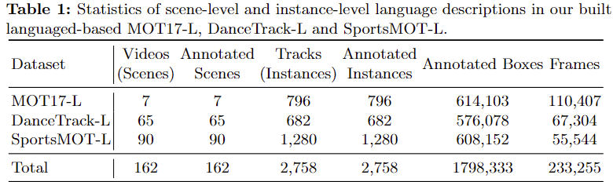
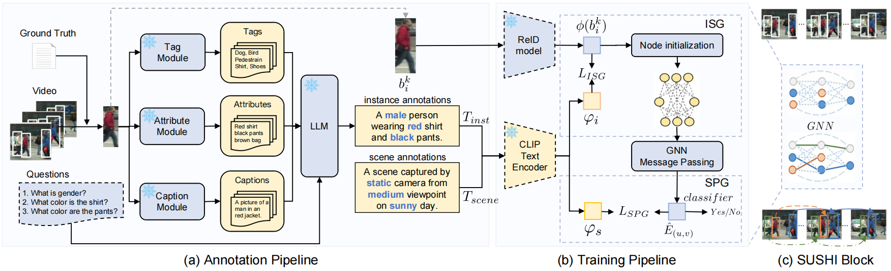
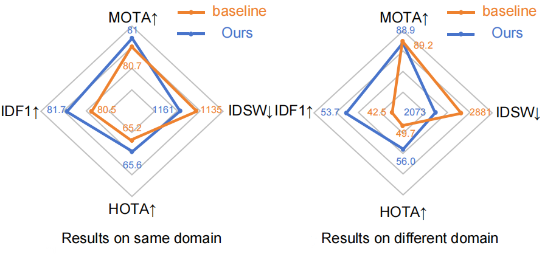

# LG-MOT
### **Multi-Granularity Language-Guided Multi-Object Tracking**

<p align="center">
    
</p>

#### [Yuhao Li](), [Muzammal Naseer](https://muzammal-naseer.com/), [Jiale Cao](https://jialecao001.github.io/), [Yu Zhu](), [Jinqiu Sun](https://teacher.nwpu.edu.cn/m/2009010133), [Yanning Zhang](https://jszy.nwpu.edu.cn/1999000059) and [Fahad Khan](https://sites.google.com/view/fahadkhans/home)


#### **Northwestern Polytechnical University， Mohamed bin Zayed University of AI, TianJin University, Linköping University**

<!-- [](site_url) -->
[](https://arxiv.org/abs/2406.04844.pdf)

## Latest 
- `2024/06/11`: We released our technical report on [arxiv](https://arxiv.org/abs/2406.04844.pdf). Our code and models are coming soon!

<br>
<details>
  <summary>
  <font size="+1">Abstract</font>
  </summary>
Most existing multi-object tracking methods typically learn visual tracking features via maximizing dis-similarities of different instances and minimizing similarities of the same instance. While such a feature learning scheme achieves promising performance, learning discriminative features solely based on visual information is challenging especially in case of environmental interference such as occlusion, blur and domain variance. In this work, we argue that multi-modal language-driven features provide complementary information to classical visual features, thereby aiding in improving the robustness to such environmental interference. To this end, we propose a new multi-object tracking framework, named LG-MOT, that explicitly leverages language information at different levels of granularity (scene-and instance-level) and combines it with standard visual features to obtain discriminative representations. To develop LG-MOT, we annotate existing MOT datasets with scene-and instance-level language descriptions. We then encode both instance-and scene-level language information into high-dimensional embeddings, which are utilized to guide the visual features during training. At inference, our LG-MOT uses the standard visual features without relying on annotated language descriptions. Extensive experiments on three benchmarks, MOT17, DanceTrack and SportsMOT, reveal the merits of the proposed contributions leading to state-of-the-art performance. On the DanceTrack test set, our LG-MOT achieves an absolute gain of 2.2% in terms of target object association (IDF1 score), compared to the baseline using only visual features. Further, our LG-MOT exhibits strong cross-domain generalizability.
</details>

## Intro

- **LG-MOT**  first annotate
the training sets and validation sets of commonly used MOT datasets including
[MOT17](https://motchallenge.net/data/MOT17/), [DanceTrack](https://dancetrack.github.io/) and [SportsMOT](https://github.com/MCG-NJU/SportsMOT?tab=readme-ov-file) with language descriptions
at both scene and instance levels.



- **LG-MOT** is a new multi-object tracking framework which leverages language information at different granularity during training to enhance object association capabilities. During training, our **ISG** module aligns each node embedding $\phi(b_i^k)$ with instance-level descriptions embeddings $\varphi_i$, while our **SPG** module aligns edge embeddings $\hat{E}_{(u,v)}$ with scene-level descriptions embeddings $\varphi_s$ to guide correlation estimation after message passing. Our approach does not require language description during inference.



- **LG-MOT**  increases 1.2% in terms of IDF1 over the baseline SUSHI intra-domain, while significantly improves 11.2% in cross-domain.



## Citation
if you use our work, please consider citing us:
```BibTeX
@misc{li2024multigranularity,
      title={Multi-Granularity Language-Guided Multi-Object Tracking}, 
      author={Yuhao Li and Muzammal Naseer and Jiale Cao and Yu Zhu and Jinqiu Sun and Yanning Zhang and Fahad Shahbaz Khan},
      year={2024},
      eprint={2406.04844},
      archivePrefix={arXiv},
      primaryClass={cs.CV}
}

```


## License
This project is released under the BSD-3-Clause license. See [LICENSE](LICENSE) for additional details.
